# Project documentation

## Link (URL) to published portfolio website
https://reverent-kirch-75accd.netlify.app/index.html

## Link to GitHub repo:
https://github.com/miasydney/MiaBenn_T1A2

## Purpose & Target audience:
The purpose of the portfolio is to act as an online resume for me to aid with job applications. Hence the target audience of this portfolio is prospective employers, who will be accessing the website in order to determine my suitability for job opportunities and view previous examples of my work. It is responsive to phone, tablet and desktop browsers allowing the audience to view it from any of these devices.

## Tech stack:
The tech stack used to create it includes: HTML, CSS, Git, GitHub and Netlify. 

## Functionality/Features:
The portfolio site features a home page as well as four additional pages which are all accessible via the main menu bar/navigation bar. These include: about, projects, contact and blog. It also features a menu bar item which links to a PDF resume in a new tab, allowing for employers to easily access and download my resume. The navigation bar is viewable on every page to allow for easy navigation around the website and is styled using flex wrap for better responsiveness across mobile, tablet and desktop size screens. 
Some features including the resume, blog and projects section have been appropriately styled however include placeholder text for the time being, I plan to populate these with actual content that relates to my portfolio over the duration of this course.
THe project page features styled cards to clearly separate each project. I will be selecting a few key projects for the website, so I have kept the projects cards full width for maximum visual impact and more attention to be placed on each featured project. 
The blog page similarly features styled cards to clearly separate each blog post. These cards contain placeholders for post headings, date published and body content. These cards are styled using flexwrap to allow for multiple posts per row on larger screen sizes. 
Each and every page features my contact information at the bottom - namely my email address (styled as a link tag that brings up an empty email addressed to me) and a link to my GitHub account. Each page also features a footer with copyright information.

## Sitemap: 

## Screenshots of all pages:
*Mobile website view:*
(Based on iPhone 12 Pro)
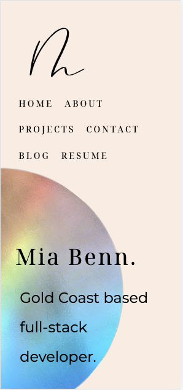
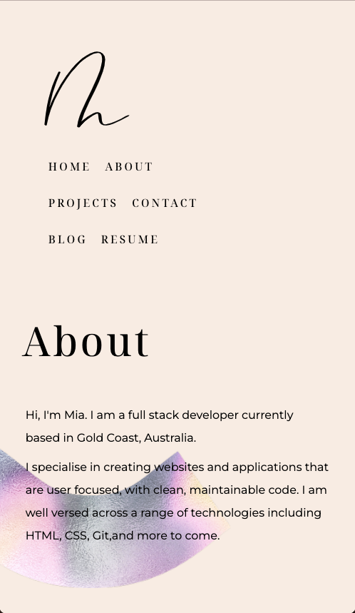
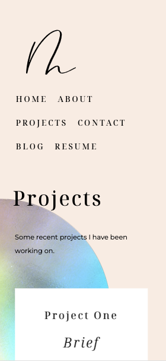
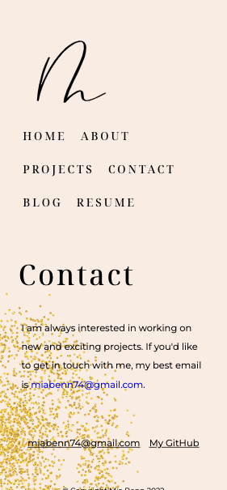
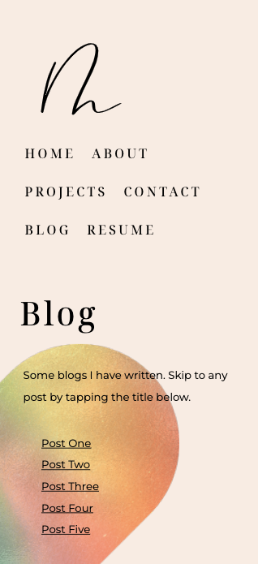

*Tablet website view:*
(Based on iPad Air)

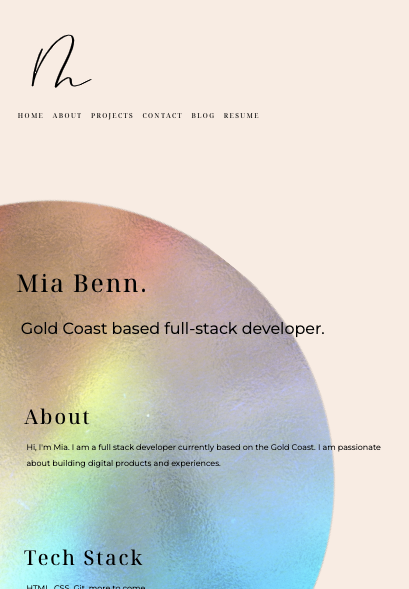
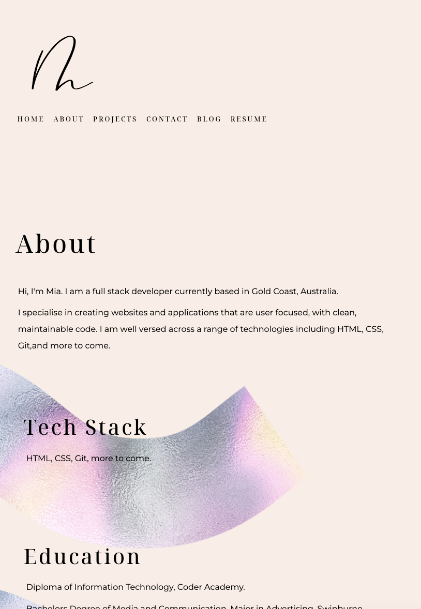
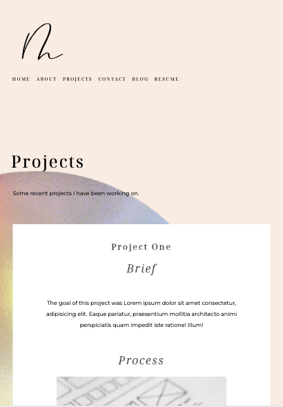
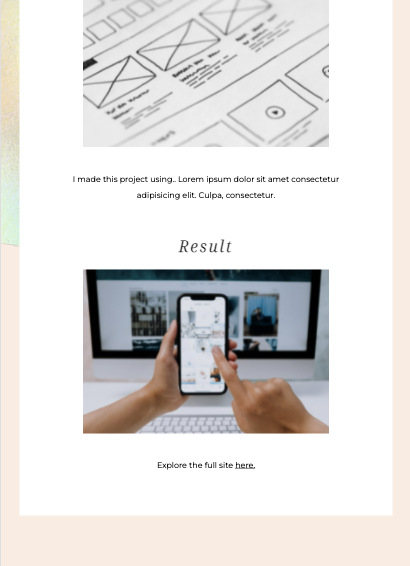
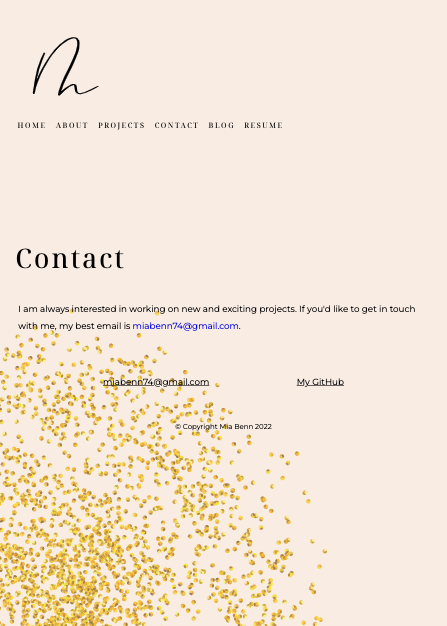
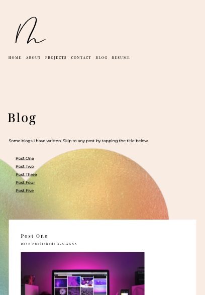

*Browser website view:*
(Based on Macbook)
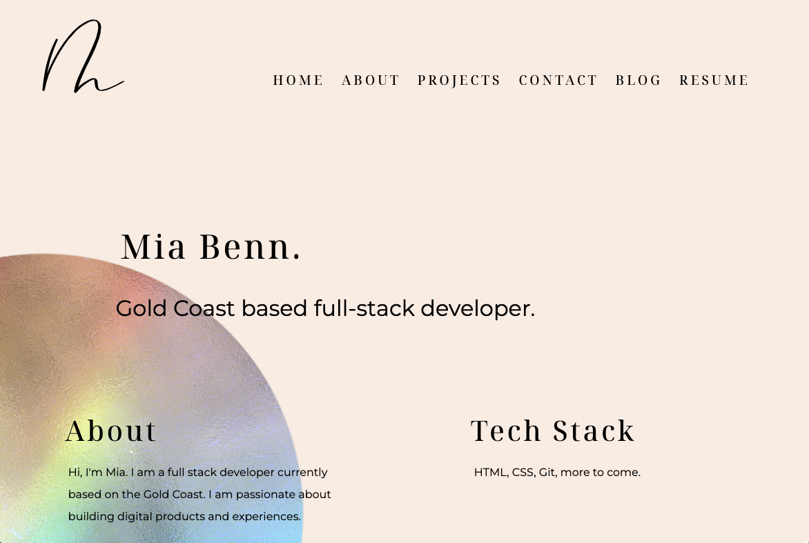
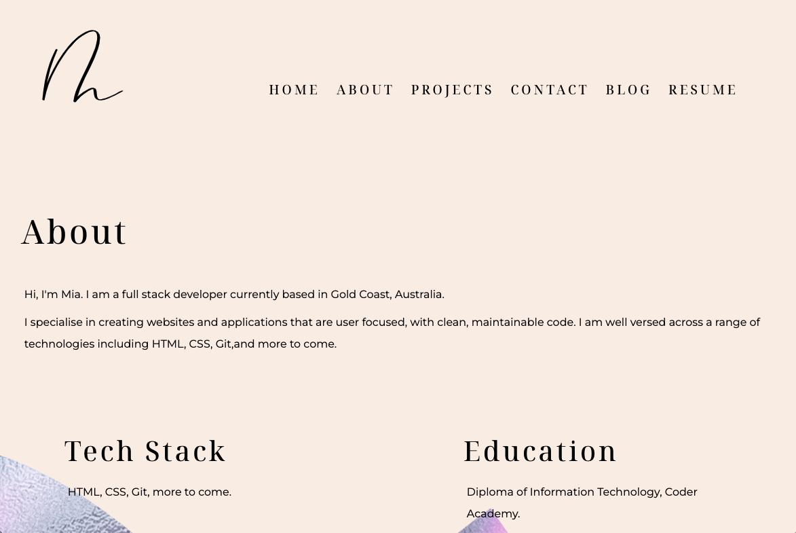
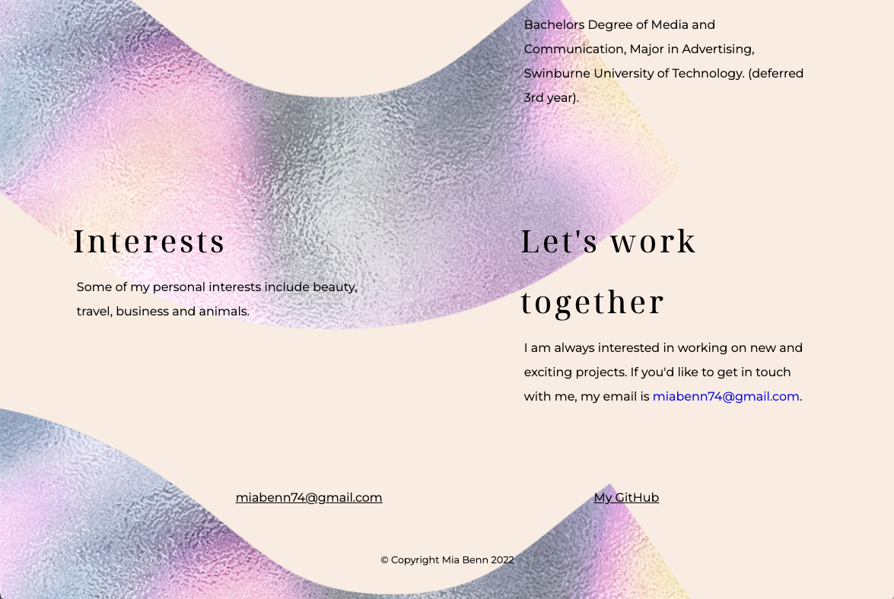
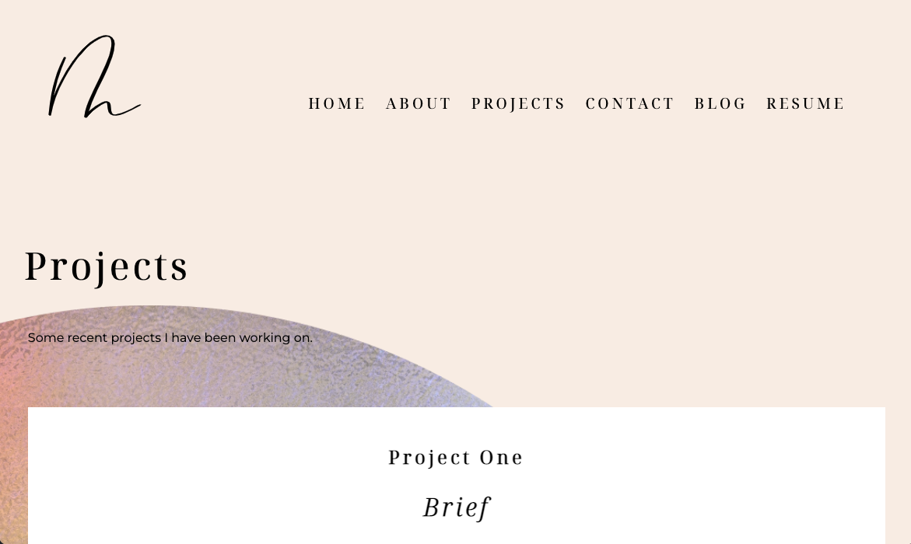
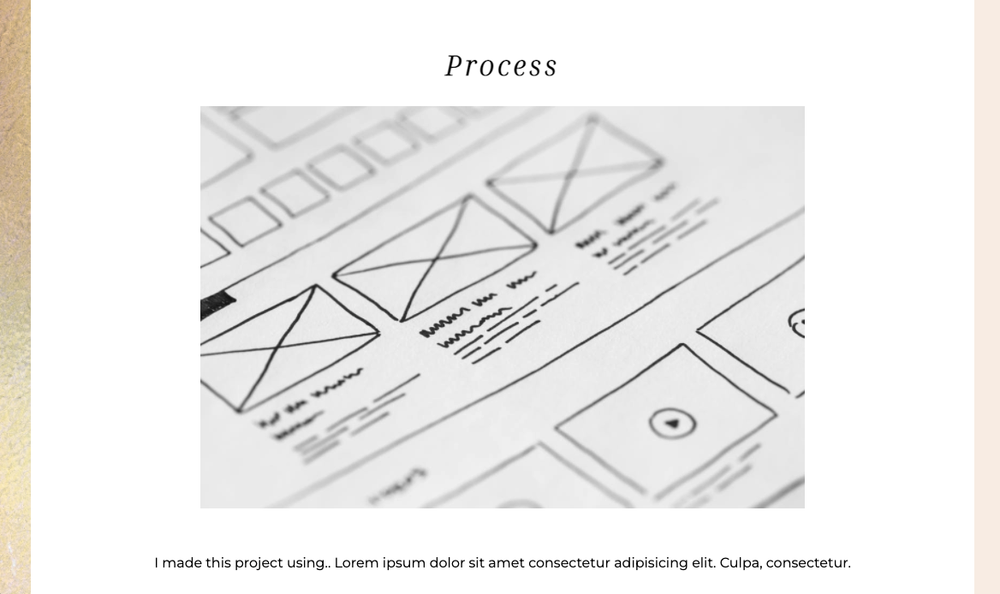
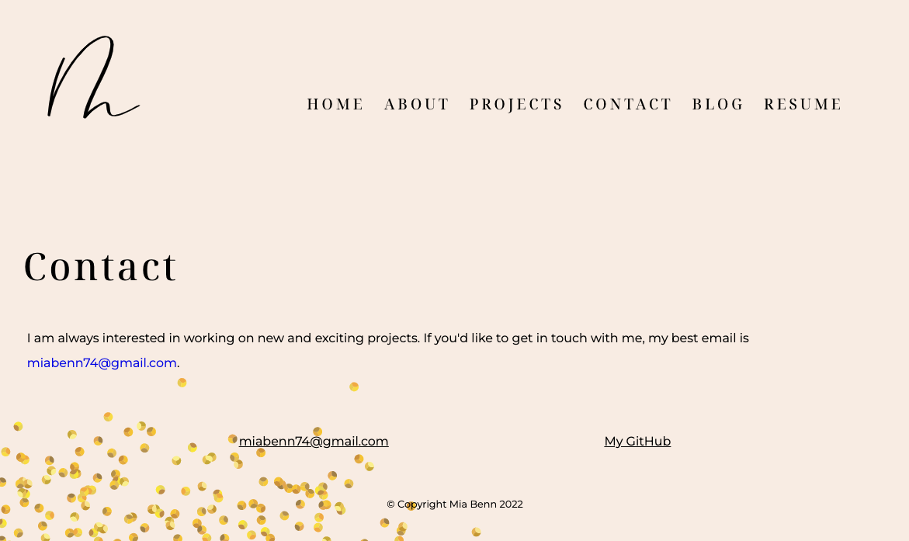
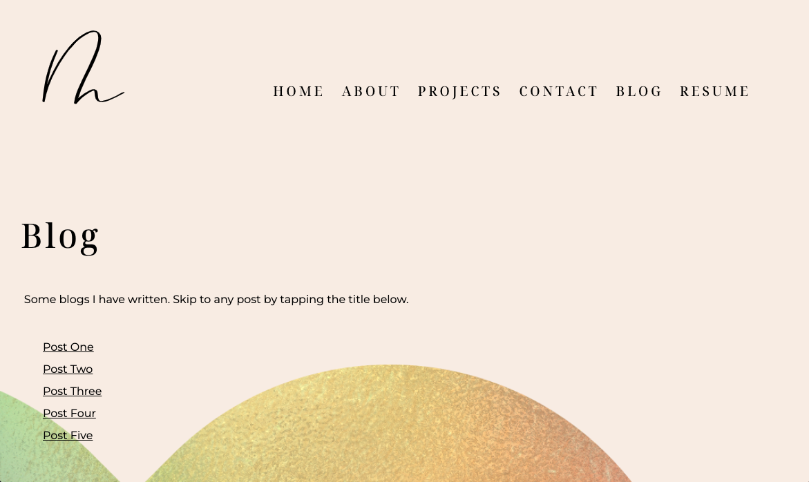
