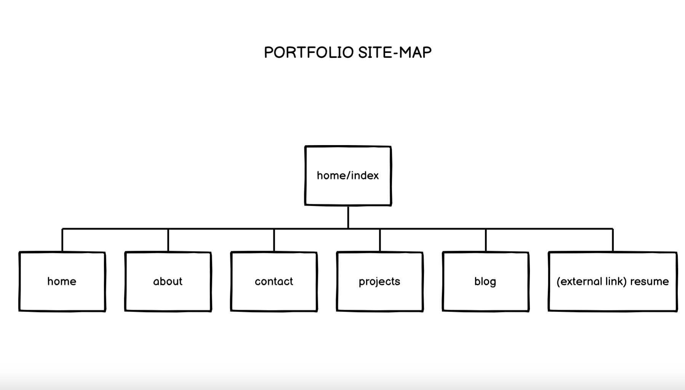

General project documentation is to be compiled as a single markdown file named README.md. This file should contain,
* A link (URL) to your published portfolio website

* A link to your GitHub repo

* Purpose & Target audience:
The purpose of the portfolio is to act as an online resume for me to aid with job applications. Hence the target audience of this portfolio is prospective employers, who will be accessing the website in order to determine my suitability for job opportunities and acces previus examples of my work. The website functionality 

* Tech stack:
The tech stack used to create it includes: HTML, CSS, Git, GitHub, Netlify. 

* Functionality/Features:
The portfolio site features a home page as well as four additional pages which are all accessible via the main menu bar/navigation bar. These include: about, projects, contact and blog. It also features a menu bar item which links to a PDF resume in a new tab, allowing for employers to easily access and download my resume. The navigation bar is viewable on every page to allow for easy navigation around the website and is styled using flex wrap for better responsiveness across mobile, tablet and desktop size screens. 
Some features including the resume, blog and projects section have been appropriately styled however include placeholder text for the time being, I plan to populate these with actual content that relates to my portfolio over the duration of this course.
Both the projects and blog page feature styled cards to clearly separate each project as well as each blog post (see screenshots below).  
Each and every page features my contact information at the bottom - namely my email address (styled as a link tag that brings up an empty email addressed to me) and a link to my GitHub account.

* Sitemap: 

Screenshots:
Mobile website view: 
(Based on iPhone 12 Pro)

Tablet website view:
(Based on iPad Air)

Browser website view:
(Based on Macbook)

